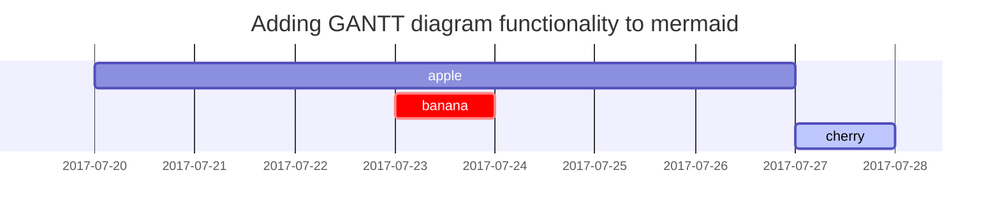

## Paragraph

The printer used for the project is a refurbished Ender 3 model, which has undergone extensive modifications aimed at enhancing both print speed and quality. Additionally, it operates on an open-source operating system called Klipper, facilitating ease of further customization and modification.

# Modifications Section
<!-- markdownlint-capture -->
<!-- markdownlint-disable -->
## Hardware
{: data-toc-skip='' .mt-4 .mb-0}
Below is a list of the hardware modifications that the printer has undergone. 

- [**Bed Distance Sensor**](https://www.pandapi3d.com/bdsensor)
- [**SKR Mini E3 V3 Motherboard**](https://biqu.equipment/products/bigtreetech-skr-mini-e3-v2-0-32-bit-control-board-for-ender-3?srsltid=AfmBOor38fAOfnimuZtrh9MGdwj-AUFmHmWXd-LcRXiLTQDLi6i3duNx)
- [**Dual Z axis**](https://www.amazon.com/Official-Creality-Upgrade-Stepper-3D/dp/B09N8QQDSP)
- [**Direct Drive Orbiter V2.0 Extruder**](https://www.orbiterprojects.com/orbiter-v2-0/)
- [**Custom Hotend Cooling**](https://www.printables.com/model/544890-apollolander-stock-hotend-dual-5015?lang=en)
- CHT nozzle
- Slimmer PSU
- PTFE Bowden Tube.   
<!-- markdownlint-restore -->

## BDsensor 

Description
: BD sensor is the first distance sensor that can work with 3D printer and do fast bed leveling and adjust z axis in real time. {: width="300" height="250" .w-50 .right}


Part List
: The parts required were a BDsensor (bought here <https://www.pandapi3d.com/bdsensor>) and the modified portion of the custom hotend cooling  


Instructions
: Here was the video that I following along with, it is very thorough <https://www.youtube.com/watch?v=VDOYYskbxV8>

> Note that the cable connecting to the black magnetic core coil is somewhat fragile and can snap off it turned or twisted too much.
{: .prompt-danger }
<!-- markdownlint-restore -->

Results
: The results are the BDsensor are a before and after of using a different bedleveling hardware call a bltouch. 


## SKR Mini E3 V3 Motherboard


### Ordered list

1. Firstly
2. Secondly
3. Thirdly

### Unordered list

- Chapter
  - Section
    - Paragraph

### ToDo list

- [ ] Job
  - [x] Step 1
  - [x] Step 2
  - [ ] Step 3

### Description list

Sun
: the star around which the earth orbits

Moon
: the natural satellite of the earth, visible by reflected light from the sun

## Block Quote

> This line shows the _block quote_.

## Prompts

<!-- markdownlint-capture -->
<!-- markdownlint-disable -->
> An example showing the `tip` type prompt.
{: .prompt-tip }

> An example showing the `info` type prompt.
{: .prompt-info }

> An example showing the `warning` type prompt.
{: .prompt-warning }

> An example showing the `danger` type prompt.
{: .prompt-danger }
<!-- markdownlint-restore -->

## Tables

| Company                      | Contact          | Country |
| :--------------------------- | :--------------- | ------: |
| Alfreds Futterkiste          | Maria Anders     | Germany |
| Island Trading               | Helen Bennett    |      UK |
| Magazzini Alimentari Riuniti | Giovanni Rovelli |   Italy |

## Links

<http://127.0.0.1:4000>

## Footnote

Click the hook will locate the footnote[^footnote], and here is another footnote[^fn-nth-2].

## Inline code

This is an example of `Inline Code`.

## Filepath

Here is the `/path/to/the/file.extend`{: .filepath}.

## Code blocks

### Common

```text
This is a common code snippet, without syntax highlight and line number.
```

### Specific Language

```bash
if [ $? -ne 0 ]; then
  echo "The command was not successful.";
  #do the needful / exit
fi;
```

### Specific filename

```sass
@import
  "colors/light-typography",
  "colors/dark-typography";
```
{: file='_sass/jekyll-theme-chirpy.scss'}

## Mathematics

The mathematics powered by [**MathJax**](https://www.mathjax.org/):

$$
\begin{equation}
  \sum_{n=1}^\infty 1/n^2 = \frac{\pi^2}{6}
  \label{eq:series}
\end{equation}
$$

We can reference the equation as \eqref{eq:series}.

When $a \ne 0$, there are two solutions to $ax^2 + bx + c = 0$ and they are

$$ x = {-b \pm \sqrt{b^2-4ac} \over 2a} $$

## Mermaid SVG

